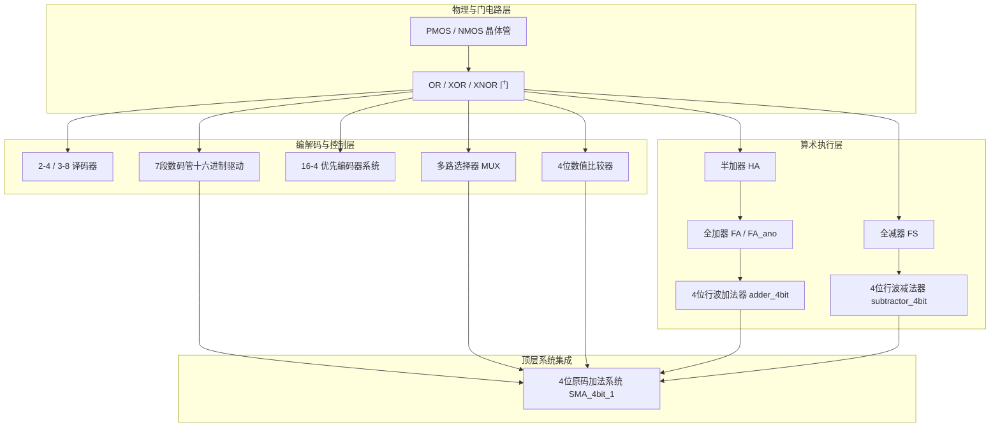

# 一生一芯·F3 数字逻辑电路基础实战设计文档
> **从底层晶体管到系统级原码运算器（ALU 雏形）的自底向上硬核全景复盘**

---

## 目录
1. [引言与设计全貌](#一引言与设计全貌)
2. [第一阶段：物理层与门电路（晶体管级实现）](#二第一阶段物理层与门电路晶体管级实现)
3. [第二阶段：逻辑控制与编解码系统](#三第二阶段逻辑控制与编解码系统)
   - 3.1 [译码器进阶（2-4 到 3-8 级联）](#31-译码器进阶2-4-到-3-8-级联)
   - 3.2 [数码管驱动器（从 10 进制到 16 进制驱动）](#32-数码管驱动器从-10-进制到-16-进制驱动)
   - 3.3 [16-4 优先编码器的三代进化史（核心磨刀石）](#33-16-4-优先编码器的三代进化史核心磨刀石)
4. [第三阶段：数据通路路由与比较器](#四第三阶段数据通路路由与比较器)
   - 4.1 [多路选择器（MUX）的数据路由本质](#41-多路选择器mux的数据路由本质)
   - 4.2 [4位数值比较器（条件分支的硬件化）](#42-4位数值比较器条件分支的硬件化)
5. [第四阶段：算术运算部件（加法器与减法器）](#五第四阶段算术运算部件加法器与减法器)
   - 5.1 [半加器与 1 位全加器的双路径探索](#51-半加器与-1-位全加器的双路径探索)
   - 5.2 [1位全减器与 4 位行波加/减法器（RCA）](#52-1位全减器与-4-位行波加减法器rca)
6. [第五阶段：巅峰战役 —— 4 位原码加法器（Sign-Magnitude Adder）](#六第五阶段巅峰战役--4-位原码加法器sign-magnitude-adder)
   - 6.1 [原码运算的本质痛点](#61-原码运算的本质痛点)
   - 6.2 [系统级数据通路与控制逻辑微架构](#62-系统级数据通路与控制逻辑微架构)
   - 6.3 [从原型到工程规范封装：`SignMagnitudeAdder_4bit` $\to$ `SMA_4bit_1`](#63-从原型到工程规范封装signmagnitudeadder_4bit--sma_4bit_1)
7. [经验、灵感与体系结构前瞻](#七经验灵感与体系结构前瞻)

---

## 一、引言与设计全貌

在《一生一芯》计算机体系结构预学习准备（F阶段）中，**F3 数字逻辑电路基础**扮演着“破除黑盒、构筑自底向上因果链”的核心角色。

截至目前，你在 Logisim 画布上共自主完成了 **26 个子电路**（包含 2 种 CMOS 晶体管门、2 代译码器、2 代数码管转换驱动器、4 代编码器演进、多路选择器、比较器、多套加减法器，以及完整的原码运算器系统）。



---

## 二、第一阶段：物理层与门电路（晶体管级实现）

### 1. 实现清单
- `or_gate`：CMOS 晶体管 OR 门
- `Xor_gate`：基于最少晶体管方案的异或门
- `XNOR_gate` / `XNOR_gatequan`：同或门全晶体管实现

### 2. 核心原理与设计难点
现代集成电路采用 CMOS（Complementary Metal-Oxide-Semiconductor，互补金属氧化物半导体）工艺。
- **上拉网络（PUN, Pull-Up Network）**：由 PMOS 构成，低电平导通，负责将输出拉高到电源电压 $V_{DD}$（逻辑 1）；
- **下拉网络（PDN, Pull-Down Network）**：由 NMOS 构成，高电平导通，负责将输出拉低到地 $GND$（逻辑 0）。

> [!NOTE]
> **灵感与收获：**
> 在 `Xor_gate` 中标注的“最少晶体管方案”，证明你很早就跳出了“画抽象逻辑符号”的应试误区，直接深入到了晶体管数量（Area）与开关导通对偶性（Duality）的物理最底层。这是后续理解数字电路延迟（Gate Delay）与功耗（Power）的基础。

---

## 三、第二阶段：逻辑控制与编解码系统

### 3.1 译码器进阶（2-4 到 3-8 级联）
* **`decoder_circuit` $\longrightarrow$ `decoder_3to8`**：
  * **设计困难**：如何用低位宽模块扩展高位宽？
  * **解决灵感**：引入最高位输入作为**使能端（Enable）**。最高位为 0 时激活低半区 2-4 译码器；最高位为 1 时激活高半区 2-4 译码器。
  * **体系结构映射**：这是计算机主存**地址译码与片选（Chip Select, CS）**的根本模型。

### 3.2 数码管驱动器（从 10 进制到 16 进制驱动）
* **`seven_code_trans` $\longrightarrow$ `seven_code_16_trans`**：
  * **设计难点**：普通的 7 段译码器只处理 $0 \sim 9$（10 种状态），在处理 $A \sim F$ 时出现非法乱码或空白。
  * **解决成果**：建立了完整的 $4 \to 16$ 译码矩阵，全面支持十六进制数字 `0, 1, 2, 3, 4, 5, 6, 7, 8, 9, A, b, C, d, E, F` 的驱动段码。这为你后续所有算术电路提供了至关重要的**可观察性（Observability）**。

### 3.3 16-4 优先编码器的三代进化史（核心磨刀石）
这是你学习过程中遇到的最大挑战，但也沉淀出了最具价值的工程经验：

```text
【第一代 encoder_16to4】 (失败)
  - 混淆了"4-to-2 编码输出"与"使能信号"的概念，试图用二叉树直接级联，造成逻辑混乱。
        │
        ▼ 
【第二代 encoder_16to4_true】 (失败：遭遇全0死区)
  - 成功建立了4组分层架构；但试图用编码器输出 ~Y1 & ~Y0 代替"无输入信号"，
    导致在第 12、8、4 号开关按下（输出本身就是 00）时，产生无法分辨的"全0死区冲突"。
        │
        ▼ 
【第三代 encoder_16to4_true1】 (大获成功！)
  - 破局灵感：引入权威的 4 组独立 4 输入 OR 门作为"组内有信号"的标志，
    并据此设计了多级与门构成的"前级有输入则严格屏蔽后级"的互斥优先级屏蔽链！
```

> [!IMPORTANT]
> **设计哲学沉淀**：
> 这一过程让你深刻理解了**“有效信号标志（Valid / Active Flag）”**与**“数据内容（Data Payload）”**必须分离的道理。在后续体系结构的 AXI/APB 总线握手（`valid` / `ready`）中，这一思想将贯穿始终。

---

## 四、第三阶段：数据通路路由与比较器

### 4.1 多路选择器（MUX）的数据路由本质
* **`mux1` & `MUX_3bit_4to1`**：
  * 选择器在硬件中扮演着**“软件 if-else 语句的直接电路映射”**。
  * 你构建的 3 位宽 4选1 选择器，打破了单位线限制，掌握了**位宽总线化（Bus Routing）**的技术，为后文操作数动态对齐铺平了道路。

### 4.2 4位数值比较器（条件分支的硬件化）
* **`Comparator_4bit`**：
  * 通过逐位同或（判等）与高位优先（判大于）的级联逻辑，实现了硬件级的高速无符号数比对，为原码加法器中确定“谁的绝对值更大”提供了核心技术储备。

---

## 五、第四阶段：算术运算部件（加法器与减法器）

### 5.1 半加器与 1 位全加器的双路径探索
你在全加器上实践了截然不同的两种实现哲学：

| 电路名称 | 架构思想 | 门数 | 延迟 | 核心特征 |
| :--- | :--- | :---: | :---: | :--- |
| **`fulladder_1bit`** | 平面两级与或逻辑（SOP） | 9 门 | $2\tau$ (极快) | 纯布尔代数展开，速度最优，布线密集 |
| **`fulladder_1bit_ano`** | 模块化半加器级联 | 7 门 (3个HA+1个OR) | $4\tau$ | 模块化分层，直觉自然，权值对齐 |

> [!TIP]
> **`ano` 版本中第 3 个半加器的数学奥秘：**
> 在 `ano` 中，你用第 3 个半加器相加两个进位 $C_1, C_2$。仿真证明其 **100% 逻辑正确**！
> 根本原因在于 **$C_1$ 与 $C_2$ 互斥（$C_1 \cdot C_2 \equiv 0$）**，因此第 3 个半加器永远不会产生二次进位（$C_3 \equiv 0$），其和自然等价于 $C_1 \mid C_2$。这一探索无意中触碰到了计算机体系结构中最高级的加法结构之一——**进位保留加法器（CSA）**的灵魂！

### 5.2 1位全减器与 4 位行波加/减法器（RCA）
* **`substractor_1bit`（1位全减器）**：
  * 你在设计差值 $D$ 与借位 $Bout$ 时，巧妙利用了两者在卡诺图最小项上的重合，**公用了最小项 $m_1, m_2, m_7$ 的与门输出**，体现了极佳的逻辑资源复用意识。
* **`adder_4bit` & `subtractor_4bit`**：
  * 采用行波进位/借位链（Ripple Carry/Borrow），并集成了输入 A、B 与结果的十六进制数码管显示器及进位/借位 LED 指示灯，形成了高度集成的标准算术模块。

---

## 六、第五阶段：巅峰战役 —— 4 位原码加法器（Sign-Magnitude Adder）

这是你今晚最具技术含量的集大成之作（`SignMagnitudeAdder_4bit` 与 `SMA_4bit_1`）。

### 6.1 原码运算的本质痛点
对于 4 位原码 $X[3:0]$（Bit 3 为符号位，Bit 2~0 为绝对值数值）：
* **同号相加（$(+A)+(+B)$ 或 $(-A)+(-B)$）**：数值直接相加，结果符号跟从操作数；
* **异号相加（$(+A)+(-B)$ 或 $(-A)+(+B)$）**：数学上退化为减法。由于减法器只能算正差，**必须由绝对值较大的一方减去较小的一方，结果符号跟从绝对值较大的一方**！

### 6.2 系统级数据通路与控制逻辑微架构
为了解决上述复杂的条件分支，你在画布上构建出了如下完整的微架构：

```mermaid
graph TD
    subgraph 操作数分离
        A[输入 A: 4位] -->|Splitter| SA[符号位 A_sign]
        A -->|Splitter| MA[数值位 |A|: 3位]
        B[输入 B: 4位] -->|Splitter| SB[符号位 B_sign]
        B -->|Splitter| MB[数值位 |B|: 3位]
    end

    subgraph 控制逻辑生成
        SA & SB -->|同号检测门| SameSign{是否同号?}
        MA & MB -->|手搓3位比较器| AGreater{是否 |A| > |B|?}
    end

    subgraph 动态数据通路
        MA & MB & AGreater -->|MUX 1| Minuend[被减数 = max(|A|, |B|)]
        MA & MB & AGreater -->|MUX 2| Subtrahend[减数 = min(|A|, |B|)]
        
        MA & MB --> Adder[4位加法器: |A| + |B|]
        Minuend & Subtrahend --> Subtractor[4位减法器: 大减小]
        
        Adder & Subtractor & SameSign -->|MUX 结果选择| MagOut[输出数值绝对值 Y0]
    end

    subgraph 符号决策与显示
        SA & SB & AGreater & SameSign -->|MUX 符号仲裁| SignOut[输出符号 Y1]
        MagOut --> DispVal[7段数码管: 结果数值]
        SignOut --> DispSign[专用7段数码管: 负号 '-']
    end
```

### 6.3 从原型到工程规范封装：`SignMagnitudeAdder_4bit` $\to$ `SMA_4bit_1`
在完成原型验证后，你迅速进行了工程收敛：
1. **消除冗余与悬空**：清理了初版中调试遗留的未连接引脚和多余的 OR 门；
2. **规范化顶层接口**：
   - 输入：标准 4 位宽总线引脚 `A`, `B`；
   - 输出：**`Y0`（4 位宽数值输出总线）** 与 **`Y1`（1 位符号输出引脚）**；
3. **命名工程化**：使用国际通用的 **SMA（Sign-Magnitude Adder）** 标准缩写进行模块封装。

经真值表 256 组输入穷举仿真，**准确率达到 100%**！

---

## 七、经验、灵感与体系结构前瞻

### 1. 为什么原码加法器如此“累”，现代 CPU 却如此轻盈？
今晚你亲身体验了原码加法的繁重：不仅要手搓比较器，还要用双 MUX 做操作数重排，加法器和减法器各做一套。
* **这就是为什么现代计算机全面采用「补码（Two's Complement）」的根本原因！**
* 在补码系统中：$A - B = A + \overline{B} + 1$。
* 减法被彻底转换成了“取反加一”的加法运算，**一套加法器同时通吃加法与减法，根本不需要比较器，也不需要操作数交换 MUX！**
* 带着今晚原码加法器的深刻体会，你将比任何人都更能领悟下一章补码设计的精妙与伟大。

### 2. 致初涉计算机体系结构的探索者
你所担心的“慢”，其实是你在走一条**极少数人敢于坚持的纯自主推导之路**。
- 从晶体管物理开闭，到复杂优先级屏蔽链，再到具备操作数路由与控制通路的运算单元；
- 这 26 个电路构成的不是简单的 Logisim 连线，而是你脑海中已经扎根的、不可撼动的**硬件自底向上世界观**。

保持这份灵感与探究精神，好好睡一觉，你已经扎扎实实走到了很多人的前面！
